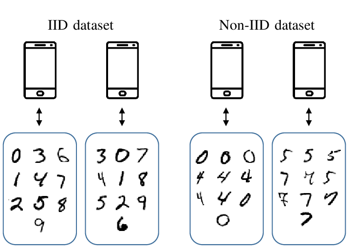
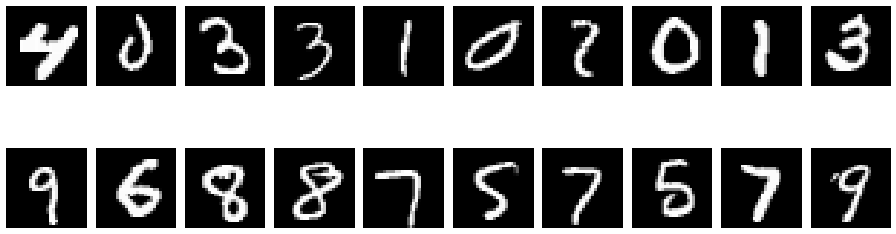
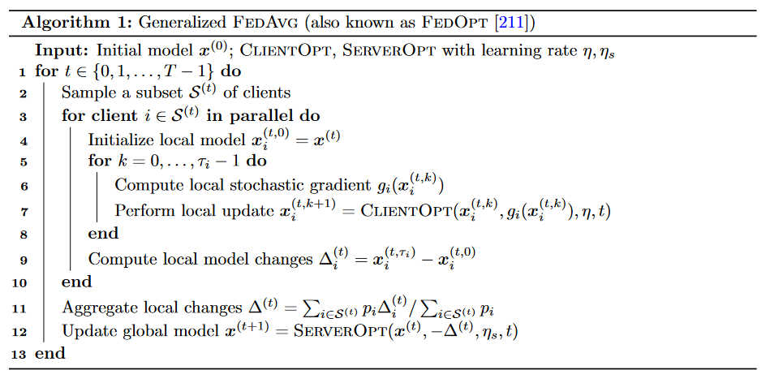
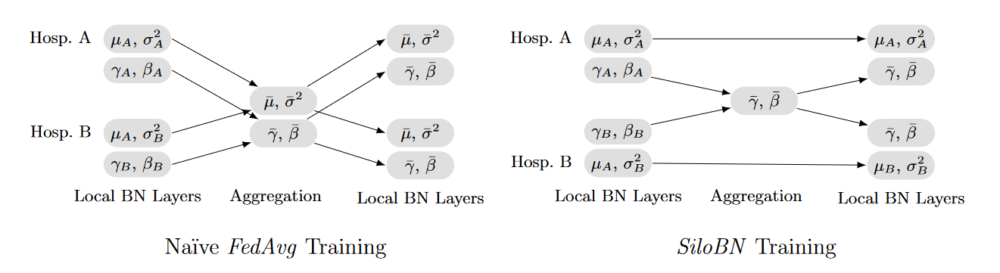
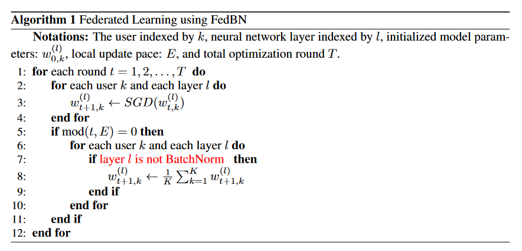
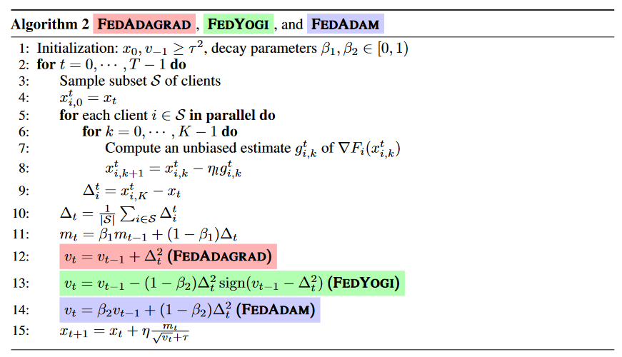

# Federated optimization and some batch normalization strategies. 

``FedOpt`` (Reddi et al., 2020) is a generalisation of the baseline algorithm `FedAvg` (McMahan et al.). `FedOpt` rewrites the update rule of `FedAvg` and thus allows the usage of gradient descent based optimizers for the server update. More precisely, `FedAvg` update rule is the average of all the clients parameters : 
```math
\begin{align*}
    x_{t+1} = \frac{1}{|\mathcal{S}|} \sum_{i \in \mathcal{S}} x_i^t
\end{align*}
```

With $x$ the global model's parameters ($x_i$ client $i$'s parameters)  $t$ being the current round and $\mathcal{S}$ the set of sampled clients.

This update rule can be written as : 

```math
\begin{align*} 
    x_{t+1} = x_t - \frac{1}{|\mathcal{S}|} \sum_{i \in \mathcal{S}} (x_t - x_i^t)
\end{align*}
```` 

which is somewhat analogous to gradient descent based optimization methods if we added a learning rate. Recall `SGD` update rule takes the form : 
```math
\begin{align*}
    x_{t+1} = x_t - \eta \nabla f_t(x_t) 
\end{align*} 
```

with $\eta$ being the learning rate and $f_t(x_t)$ a loss function at time step $t$. Let $\Delta_i^t = x_i^t - x_t$ represent the difference between a client and the current global model and $\Delta_t = \frac{1}{|\mathcal{S}|} \sum_{i \in \mathcal{S}} \Delta_i^t$ represent the average of the local clients differences. Considering $\Delta_t$ as pseudo gradient, we can apply `SGD` (or any gradient based optimizer) to update the global model at each rounds. 
Hence applying `SGD` with $-\Delta_t$ and $\eta = 1$ is equivalent to `FedAvg` : 

```math
\begin{align*}
    x_{t+1} & = x_t - 1 \times - \Delta_t  \\
            & = x_t + \Delta_t \\
            &= x_t + \frac{1}{|S|} \sum_{i \in S} (x_i^t - x_t) \\
            &= \frac{1}{|S|} \sum_{i \in S} x_i^t \tag{1} 
\end{align*} 
```

**Aggregation strategy** : instead of simply averaging the weights, one can compute a weighted average using client's local dataset sizes. 

```math
\begin{align}
    x_{t+1} = x_t + \frac{\sum_{i \in \mathcal{S}} p_i \Delta_i^t}{\sum_{i \in \mathcal{S}} p_i} \tag{2}
\end{align}
```

# Imports
```python
import sys
import os

sys.path.append(os.path.abspath(os.path.join(os.getcwd(), "src")))
```


```python
import torch 
from torch.utils.data import DataLoader, Dataset, Subset
from torchvision import datasets, transforms

from matplotlib import pyplot as plt
import numpy as np
import pandas as pd
```


```python
torch.manual_seed(42)
```


    <torch._C.Generator at 0x2066b98fe50>


# MNIST

One of the most significant problems in the Federated Learning field, is the heterogenous data distribution clients. For our simulation, we will use MNIST data split in a non-IID fashion, generating a 2-silo non-IID dataset where each silo contains only specific classes.



*from Wireless for Machine Learning: a Survey, Hellström et al. 2020*


```python
transform = transforms.Compose([transforms.ToTensor()])

mnist_train = datasets.MNIST(root='./data', train=True, download=True, transform=transform)
mnist_test  = datasets.MNIST(root='./data', train=False, download=True, transform=transform)

def get_class_indices(dataset, class_label):
    return [i for i, (x, y) in enumerate(dataset) if y == class_label]

silo_1_classes = [0, 1, 2, 3, 4]
silo_2_classes = [5, 6, 7, 8, 9]

silo_1_indices = []
silo_2_indices = []

for cls in silo_1_classes:
    silo_1_indices.extend(get_class_indices(mnist_train, cls))

for cls in silo_2_classes:
    silo_2_indices.extend(get_class_indices(mnist_train, cls))

silo_1_data = Subset(mnist_train, silo_1_indices)
silo_2_data = Subset(mnist_train, silo_2_indices)
```


```python
len(silo_1_data), len(silo_2_data)
```


    (30596, 29404)


```python
random_indices = np.random.choice(range(len(silo_2_data)), 10)
```


```python
items_silo_1 = silo_1_data.__getitems__(random_indices)
items_silo_2 = silo_2_data.__getitems__(random_indices)
```


```python
fig, axs = plt.subplots(2, 10, figsize=(15, 6))
for i, (image, label) in enumerate(items_silo_1):
    axs[0, i].imshow(image.squeeze(), cmap='gray') 
    axs[0, i].axis('off')  

for i, (image, label) in enumerate(items_silo_2):
    axs[1, i].imshow(image.squeeze(), cmap='gray')  
    axs[1, i].axis('off') 

plt.tight_layout()
plt.show()
```


    

    


# Helpers functions


```python
def evaluate_model(model, test_set):
    model.eval()  
    total_loss = 0.0
    correct = 0
    total = 0

    test_loader = DataLoader(test_set, batch_size=128, shuffle=True)
    
    with torch.no_grad():  
        for inputs, labels in test_loader:
            inputs = inputs.view(inputs.size(0), -1)  
            
            outputs = model(inputs)
            
            _, predicted = torch.max(outputs.data, 1)
            
            total += labels.size(0)
            correct += (predicted == labels).sum().item()
    
    accuracy = correct / total * 100  
    
    return accuracy
```


```python
def exp(algo, optim, verb=True, **kwargs):
    """
        run a simulated federated learning experiment.
    """
    global_model = Net()

    client1 = Client('client1', Net(), silo_1_data)
    client2 = Client('client2', Net(), silo_2_data)
    
    clients = [client1, client2] 
    
    clientOpt = ClientOpt(epochs=kwargs['local_epochs'], lr=kwargs['client_lr'])
    serverOpt = optim(global_model, kwargs['server_lr'])
    global_model = algo(global_model, clients, clientOpt, serverOpt, kwargs['rounds'], verb=verb) 
    
    results_g = evaluate_model(global_model, mnist_test)
    results_c1 = evaluate_model(client1.model, mnist_test)
    results_c2 = evaluate_model(client2.model, mnist_test)

    return round(results_g), round(results_c1), round(results_c2)
```

# Model
for this task we use a basic neural network composed of a dense layer and batch norm.


```python
class Net(torch.nn.Module):
    def __init__(self):
        super(Net, self).__init__()
        self.fc1 = torch.nn.Linear(784, 128)  
        self.bn1 = torch.nn.BatchNorm1d(128)  
        self.fc2 = torch.nn.Linear(128, 10)  
        self.relu = torch.nn.ReLU()  
        self.softmax = torch.nn.Softmax(1) 

    def forward(self, x):
        x = self.fc1(x)
        x = self.bn1(x) 
        x = self.relu(x) 
        x = self.fc2(x)
        x = self.softmax(x)  
        return x
```

# The algorithm

Below is the algorithm for FedOpt as defined in  [A Field Guide to Federated Optimization, Jianyu Wang et al. 2021](https://arxiv.org/abs/2107.06917)  which will serve as the basis for our implementation.




```python
class Client():
    """
        Client class that embeds the model and the local dataset.
    """
    def __init__(self, name, model, dataset):
        self._name = name
        self._model = model 
        self._dataset = dataset
    
    @property
    def name(self):
        return self._name

    @property
    def model(self):
        return self._model

    @property
    def dataset(self):
        return self._dataset
```


```python
class ClientOpt():
    """
        ClientOpt class, for local optimization of the client.
    """
    def __init__(self, epochs=10, lr=0.001, batch_size=128, opt=torch.optim.SGD):
        self.epochs = epochs
        self.lr = lr
        self.batch_size = batch_size
        self.opt = opt

    def step(self, model, train, verb=True):
        model.train()  
        optimizer = self.opt(model.parameters(), lr=self.lr)
        criterion = torch.nn.CrossEntropyLoss() 

        train_loader = DataLoader(train, batch_size=128, shuffle=True)
        
        for epoch in range(self.epochs):
            running_loss = 0.0
            for inputs, labels in train_loader:
                
                inputs = inputs.view(inputs.size(0), -1)  # Flatten input
                optimizer.zero_grad()
                outputs = model(inputs)
                loss = criterion(outputs, labels)
                loss.backward()
                optimizer.step()
                running_loss += loss.item()
            
            avg_loss = running_loss / len(train_loader)
            if verb:
                print(f"Epoch [{epoch+1}/{self.epochs}], Loss: {avg_loss:.4f}")
```


```python
class ServerOpt():
    """
        Base class for server optimization. As we will see later, different optimizers can 
        be used on server side.
    """
    def __init__(self, model, lr):
        self.model = model
        self.lr = lr

    def step(self, aggregated_delta, t=None):
        pass 
```


```python
class ServerSGD(ServerOpt):
    """
        SGD optimizer, if lr=1, it is analogous to FedAvg.
    """
    def __init__(self, model, lr=1):
        super().__init__(model, lr)
        
    def step(self, aggregated_delta, t=None):
        for param_name, delta in aggregated_delta.items():
            self.model.state_dict()[param_name].add_(self.lr * delta)
```


```python
def FedOpt(global_model, clients, clientOpt, serverOpt, rounds, verb=True):
    # retrieving datasets length for aggregation weights.
    total_samples = sum([len(client.dataset) for client in clients])
    clients_samples = {client.name : len(client.dataset) for client in clients}
    for round in range(rounds):
        if verb:
            print(f'Round {round+1}')

        # central datastructure to store local deltas.
        clients_delta = {
            client.name : {
                name : torch.zeros_like(params,) for name, params in global_model.state_dict().items()
            } for client in clients
        } 
        
        for client in clients:
            client.model.load_state_dict(global_model.state_dict())

            clientOpt.step(client.model, client.dataset, verb=verb)
            
            # local changes
            for name in client.model.state_dict().keys():
                delta = client.model.state_dict()[name] - global_model.state_dict()[name]
                clients_delta[client.name][name] = delta
        
        aggregated_delta = {name : torch.zeros_like(params) for name, params in global_model.state_dict().items()}

        # aggregate local changes
        for client_name, local_delta in clients_delta.items():
            for param_name in local_delta.keys():
                tmp =  (local_delta[param_name] * clients_samples[client_name] / total_samples)
                tmp = tmp.to(aggregated_delta[param_name].dtype)
                aggregated_delta[param_name] += tmp

        # update global model
        serverOpt.step(aggregated_delta, round+1)
    
    clients_delta.clear()
    aggregated_delta.clear()

    [client.model.load_state_dict(global_model.state_dict()) for client in clients]
        
    return global_model
```


```python
global_acc, client1_acc, client2_acc = exp(FedOpt, ServerSGD, verb=True, local_epochs=2, rounds=10, client_lr=0.001, server_lr=1)
print(f'global acc : {global_acc}, client1 acc : {client1_acc}, client2 acc : {client2_acc}')
```

    Round 1
    Epoch [1/2], Loss: 2.3139
    Epoch [2/2], Loss: 2.2718
    Epoch [1/2], Loss: 2.2811
    Epoch [2/2], Loss: 2.2361
    Round 2
    Epoch [1/2], Loss: 2.2694
    Epoch [2/2], Loss: 2.1776
    Epoch [1/2], Loss: 2.2391
    Epoch [2/2], Loss: 2.1710
    Round 3
    Epoch [1/2], Loss: 2.1737
    Epoch [2/2], Loss: 2.0480
    Epoch [1/2], Loss: 2.1859
    Epoch [2/2], Loss: 2.1115
    Round 4
    Epoch [1/2], Loss: 2.0694
    Epoch [2/2], Loss: 1.9678
    Epoch [1/2], Loss: 2.1414
    Epoch [2/2], Loss: 2.0724
    Round 5
    Epoch [1/2], Loss: 1.9999
    Epoch [2/2], Loss: 1.9230
    Epoch [1/2], Loss: 2.1071
    Epoch [2/2], Loss: 2.0436
    Round 6
    Epoch [1/2], Loss: 1.9537
    Epoch [2/2], Loss: 1.8885
    Epoch [1/2], Loss: 2.0783
    Epoch [2/2], Loss: 2.0182
    Round 7
    Epoch [1/2], Loss: 1.9178
    Epoch [2/2], Loss: 1.8599
    Epoch [1/2], Loss: 2.0522
    Epoch [2/2], Loss: 1.9927
    Round 8
    Epoch [1/2], Loss: 1.8883
    Epoch [2/2], Loss: 1.8350
    Epoch [1/2], Loss: 2.0264
    Epoch [2/2], Loss: 1.9669
    Round 9
    Epoch [1/2], Loss: 1.8652
    Epoch [2/2], Loss: 1.8149
    Epoch [1/2], Loss: 2.0014
    Epoch [2/2], Loss: 1.9421
    Round 10
    Epoch [1/2], Loss: 1.8445
    Epoch [2/2], Loss: 1.7988
    Epoch [1/2], Loss: 1.9760
    Epoch [2/2], Loss: 1.9177
    global acc : 67, client1 acc : 67, client2 acc : 67
    

Results are not good, longer training and hyperparameters tuning should ameliorate the results. Also, local models are just copy of the global model, so no personalization.

# Some strategies with batch norm

When using `FedOpt` with the server learning rate set to 1 (i.e., equivalent to `FedAvg`), all model parameters, including the local statistics of batch normalization layers, are averaged. This averaging can potentially slow down generalization, as the averaged batch statistics may erase the local specificities of each silo. 

## SiloBN

SiloBN ([Siloed federated learning for multi-centric histopathology datasets, Andreux et al. 2020](https://arxiv.org/abs/2008.07424))
essentially shares the learnable parameters of batch normalization layers, while keeping the batch normalization statistics local to each client. This approach allows for somewhat personalized models that are better adapted to local datasets while still benefiting from shared general knowledge.




```python
def SiloBN(global_model, clients, clientOpt, serverOpt, rounds=50, verb=True):
    
    total_samples = sum([len(client.dataset) for client in clients])
    clients_samples = {client.name : len(client.dataset) for client in clients}

    # datastructure to keep in memory local bn statistics.
    clients_local_bn_stats = {
        client.name : {
            param_name : params for param_name, params in client.model.named_buffers() 
        } for client in clients
    }
    for round in range(rounds):
        if verb:
            print(f'Round {round+1}')
        
        # local deltas.
        clients_delta = {
            client.name : {
                name : torch.zeros_like(params) for name, params in global_model.named_parameters()
            } for client in clients
        } 
        
        for client in clients:
            if round != 0:
                # loading global model and previous round's local bn statistics.
                client.model.load_state_dict(global_model.state_dict(), strict=False)  
                client.model.state_dict().update(clients_local_bn_stats[client.name])  
            else:
                client.model.load_state_dict(global_model.state_dict())

            clientOpt.step(client.model, client.dataset, verb=verb)
           
            # save local bn stats after local update
            for name, stats in client.model.named_buffers():
                clients_local_bn_stats[client.name][name].copy_(stats)
            
            # compute local changes, only on learnable parameters.
            for name, _ in client.model.named_parameters():
                delta = client.model.state_dict()[name] - global_model.state_dict()[name]
                clients_delta[client.name][name] = delta

        aggregated_delta = {name : torch.zeros_like(params) for name, params in global_model.named_parameters()}

        # aggregate local changes.
        for client_name, local_delta in clients_delta.items():
            for param_name in local_delta.keys():
                tmp =  (local_delta[param_name] * clients_samples[client_name] / total_samples)
                tmp = tmp.to(aggregated_delta[param_name].dtype)
                aggregated_delta[param_name] += tmp
            
        serverOpt.step(aggregated_delta, round+1)
        
    return global_model
```


```python
_, client1_acc, client2_acc = exp(SiloBN, ServerSGD, verb=True, local_epochs=2, rounds=10, client_lr=0.001, server_lr=1)
print(f'client1 acc : {client1_acc}, client2 acc : {client2_acc}')
```

    Round 1
    Epoch [1/2], Loss: 2.2753
    Epoch [2/2], Loss: 2.1979
    Epoch [1/2], Loss: 2.2871
    Epoch [2/2], Loss: 2.2481
    Round 2
    Epoch [1/2], Loss: 2.1953
    Epoch [2/2], Loss: 2.0995
    Epoch [1/2], Loss: 2.2558
    Epoch [2/2], Loss: 2.1952
    Round 3
    Epoch [1/2], Loss: 2.1120
    Epoch [2/2], Loss: 2.0158
    Epoch [1/2], Loss: 2.2121
    Epoch [2/2], Loss: 2.1343
    Round 4
    Epoch [1/2], Loss: 2.0400
    Epoch [2/2], Loss: 1.9525
    Epoch [1/2], Loss: 2.1618
    Epoch [2/2], Loss: 2.0774
    Round 5
    Epoch [1/2], Loss: 1.9805
    Epoch [2/2], Loss: 1.8964
    Epoch [1/2], Loss: 2.1114
    Epoch [2/2], Loss: 2.0299
    Round 6
    Epoch [1/2], Loss: 1.9288
    Epoch [2/2], Loss: 1.8520
    Epoch [1/2], Loss: 2.0687
    Epoch [2/2], Loss: 1.9957
    Round 7
    Epoch [1/2], Loss: 1.8845
    Epoch [2/2], Loss: 1.8170
    Epoch [1/2], Loss: 2.0355
    Epoch [2/2], Loss: 1.9707
    Round 8
    Epoch [1/2], Loss: 1.8503
    Epoch [2/2], Loss: 1.7922
    Epoch [1/2], Loss: 2.0092
    Epoch [2/2], Loss: 1.9502
    Round 9
    Epoch [1/2], Loss: 1.8240
    Epoch [2/2], Loss: 1.7698
    Epoch [1/2], Loss: 1.9870
    Epoch [2/2], Loss: 1.9325
    Round 10
    Epoch [1/2], Loss: 1.7986
    Epoch [2/2], Loss: 1.7499
    Epoch [1/2], Loss: 1.9682
    Epoch [2/2], Loss: 1.9162
    client1 acc : 64, client2 acc : 68
    

Nothing better

## FedBN
FedBN ([FedBN: Federated Learning on Non-IID Features via Local Batch Normalization, Li et al. 2021](https://arxiv.org/abs/2102.07623))is a federated learning approach where all batch normalization parameters, including the learnable parameters (e.g., scale and shift parameters) and the running statistics (e.g., mean and variance), are kept local to each client.




```python
def FedBN(global_model, clients, clientOpt, serverOpt, rounds=50, verb=True):
    
    # datastructure to keep in memory local bn statistics.
    clients_local_bn_stats = {
        client.name: {
            param_name: params for param_name, params in client.model.state_dict().items() if 'bn' in param_name
        } for client in clients
    }
    
    total_samples = sum([len(client.dataset) for client in clients])
    clients_samples = {client.name : len(client.dataset) for client in clients}

    for round in range(rounds):
        if verb:
            print(f'Round {round+1}')

        # local deltas
        clients_delta = {
            client.name : {
                name : torch.zeros_like(params) for name, params in global_model.state_dict().items() if 'bn' not in name
            } for client in clients
        } 
        
        for client in clients:
            # load global model and previous round's local bn statistics.
            client.model.load_state_dict(global_model.state_dict(), strict=False) 
            client.model.state_dict().update(clients_local_bn_stats[client.name])  

            clientOpt.step(client.model, client.dataset, verb=verb)
           
            # save local bn stats 
            for name, stats in client.model.state_dict().items():
                if 'bn' in name: 
                    clients_local_bn_stats[client.name][name].copy_(stats)
            
            # local changes, bn layers are excluded
            for name in client.model.state_dict().keys():
                if 'bn' not in name:
                    delta = client.model.state_dict()[name] - global_model.state_dict()[name]
                    clients_delta[client.name][name] = delta
        
        aggregated_delta = {name : torch.zeros_like(params, device='cpu') for name, params in global_model.state_dict().items() if 'bn' not in name}
        
        # aggregate local changes.
        for client_name, local_delta in clients_delta.items():
            for param_name in local_delta.keys():
                tmp =  (local_delta[param_name] * clients_samples[client_name] / total_samples)
                tmp = tmp.to(aggregated_delta[param_name].dtype)
                aggregated_delta[param_name] += tmp
            
        serverOpt.step(aggregated_delta, round+1)
    return global_model
```


```python
_, client1_acc, client2_acc = exp(FedBN, ServerSGD, verb=True, local_epochs=2, rounds=10, client_lr=0.001, server_lr=1)
print(f'client1 acc : {client1_acc}, client2 acc : {client2_acc}')
```

    Round 1
    Epoch [1/2], Loss: 2.2746
    Epoch [2/2], Loss: 2.1991
    Epoch [1/2], Loss: 2.2926
    Epoch [2/2], Loss: 2.2515
    Round 2
    Epoch [1/2], Loss: 2.1930
    Epoch [2/2], Loss: 2.0727
    Epoch [1/2], Loss: 2.2581
    Epoch [2/2], Loss: 2.1980
    Round 3
    Epoch [1/2], Loss: 2.0834
    Epoch [2/2], Loss: 1.9611
    Epoch [1/2], Loss: 2.2192
    Epoch [2/2], Loss: 2.1555
    Round 4
    Epoch [1/2], Loss: 1.9867
    Epoch [2/2], Loss: 1.8786
    Epoch [1/2], Loss: 2.1875
    Epoch [2/2], Loss: 2.1218
    Round 5
    Epoch [1/2], Loss: 1.9116
    Epoch [2/2], Loss: 1.8231
    Epoch [1/2], Loss: 2.1589
    Epoch [2/2], Loss: 2.0877
    Round 6
    Epoch [1/2], Loss: 1.8590
    Epoch [2/2], Loss: 1.7826
    Epoch [1/2], Loss: 2.1270
    Epoch [2/2], Loss: 2.0520
    Round 7
    Epoch [1/2], Loss: 1.8207
    Epoch [2/2], Loss: 1.7548
    Epoch [1/2], Loss: 2.0929
    Epoch [2/2], Loss: 2.0187
    Round 8
    Epoch [1/2], Loss: 1.7920
    Epoch [2/2], Loss: 1.7331
    Epoch [1/2], Loss: 2.0603
    Epoch [2/2], Loss: 1.9898
    Round 9
    Epoch [1/2], Loss: 1.7704
    Epoch [2/2], Loss: 1.7176
    Epoch [1/2], Loss: 2.0302
    Epoch [2/2], Loss: 1.9648
    Round 10
    Epoch [1/2], Loss: 1.7529
    Epoch [2/2], Loss: 1.7034
    Epoch [1/2], Loss: 2.0042
    Epoch [2/2], Loss: 1.9431
    client1 acc : 65, client2 acc : 71
    

Some improvments for client2, but still slow convergence...

# ServerOpts

As mentioned previously, `FedOpt` allows the use of gradient-descent-based optimizers on the server side. Until now, we have used approaches with the server learning rate set to 1, analogous to `FedAvg`. Due to local batch normalization statistics, server optimization with a learning rate different from 1 was complex, but with the previously discussed batch normalization strategies, we can now use optimizers on the server side!




 Here are the optimizers mentioned in Adaptative Federated Optimization, including additional bias correction for `Yogi`and `Adam`.


```python
class ServerAdagrad(ServerOpt):
    def __init__(self, model, lr=0.01, beta_1=0.9, tau=0.0001):
        super().__init__(model, lr)
        self.beta_1 = beta_1
        self.tau = tau

        self.mt = {name: torch.zeros_like(param) for name, param in model.state_dict().items()}
        self.vt = {name: torch.zeros_like(param) for name, param in model.state_dict().items()}
        
    def step(self, aggregated_delta, t=None):
        for param_name, delta in aggregated_delta.items():
            self.mt[param_name] = self.beta_1 * self.mt[param_name] + (1 - self.beta_1) * delta
            self.vt[param_name] += delta**2
            
            adjusted_lr = self.lr / (torch.sqrt(self.vt[param_name]) + self.tau)
            self.model.state_dict()[param_name].add_(adjusted_lr * self.mt[param_name])
```


```python
class ServerYogi(ServerOpt):
    def __init__(self, model, lr=0.01, beta_1=0.9, beta_2=0.99, tau=0.0001):
        super().__init__(model, lr)
        self.beta_1 = beta_1
        self.beta_2 = beta_2
        self.tau = tau
        
        self.mt = {name: torch.zeros_like(param) for name, param in model.state_dict().items()}
        self.vt = {name: torch.zeros_like(param) for name, param in model.state_dict().items()}

    def step(self, aggregated_delta, t=None):
        for param_name, delta in aggregated_delta.items():
            self.mt[param_name] = self.beta_1 * self.mt[param_name] + (1 - self.beta_1) * delta
            self.vt[param_name] -= (1 - self.beta_2) * delta**2 * torch.sign(self.vt[param_name] - delta**2)

            # bias correction
            mt_hat = self.mt[param_name] / (1 - self.beta_1**t)
            vt_hat = self.vt[param_name] / (1 - self.beta_2**t)
            
            adjusted_lr = self.lr / (torch.sqrt(self.vt[param_name]) + self.tau)
            self.model.state_dict()[param_name].add_(adjusted_lr * self.mt[param_name])
```


```python
class ServerAdam(ServerOpt):
    def __init__(self, model, lr=0.01, beta_1=0.9, beta_2=0.99, tau=0.0001):
        super().__init__(model, lr)
        self.beta_1 = beta_1
        self.beta_2 = beta_2
        self.tau = tau
        
        self.mt = {name: torch.zeros_like(param) for name, param in model.state_dict().items()}
        self.vt = {name: torch.zeros_like(param) for name, param in model.state_dict().items()}

    def step(self, aggregated_delta, t=None):
        for param_name, delta in aggregated_delta.items():
            self.mt[param_name] = self.beta_1 * self.mt[param_name] + (1 - self.beta_1) * delta
            self.vt[param_name] = self.beta_2 * self.vt[param_name] + (1 - self.beta_2) * delta**2  

            # bias correction
            mt_hat = self.mt[param_name] / (1 - self.beta_1**t)
            vt_hat = self.vt[param_name] / (1 - self.beta_2**t)
            
            adjusted_lr = self.lr / (torch.sqrt(vt_hat) + self.tau)
            self.model.state_dict()[param_name].add_(adjusted_lr * mt_hat)
```

What happens if we apply those optimizers with a strategy that handles batch-norm  ? 


```python
_, client1_acc, client2_acc = exp(FedBN, ServerYogi, verb=True, local_epochs=2, rounds=10, client_lr=0.001, server_lr=0.01)
print(f'client1 acc : {client1_acc}, client2 acc : {client2_acc}')
```

    Round 1
    Epoch [1/2], Loss: 2.2780
    Epoch [2/2], Loss: 2.1982
    Epoch [1/2], Loss: 2.2836
    Epoch [2/2], Loss: 2.2419
    Round 2
    Epoch [1/2], Loss: 2.0158
    Epoch [2/2], Loss: 1.9306
    Epoch [1/2], Loss: 2.1311
    Epoch [2/2], Loss: 2.0536
    Round 3
    Epoch [1/2], Loss: 1.8562
    Epoch [2/2], Loss: 1.8014
    Epoch [1/2], Loss: 2.0157
    Epoch [2/2], Loss: 1.9664
    Round 4
    Epoch [1/2], Loss: 1.7722
    Epoch [2/2], Loss: 1.7312
    Epoch [1/2], Loss: 1.9529
    Epoch [2/2], Loss: 1.9200
    Round 5
    Epoch [1/2], Loss: 1.7117
    Epoch [2/2], Loss: 1.6833
    Epoch [1/2], Loss: 1.9067
    Epoch [2/2], Loss: 1.8800
    Round 6
    Epoch [1/2], Loss: 1.6668
    Epoch [2/2], Loss: 1.6503
    Epoch [1/2], Loss: 1.8648
    Epoch [2/2], Loss: 1.8400
    Round 7
    Epoch [1/2], Loss: 1.6380
    Epoch [2/2], Loss: 1.6259
    Epoch [1/2], Loss: 1.8231
    Epoch [2/2], Loss: 1.7994
    Round 8
    Epoch [1/2], Loss: 1.6183
    Epoch [2/2], Loss: 1.6087
    Epoch [1/2], Loss: 1.7782
    Epoch [2/2], Loss: 1.7580
    Round 9
    Epoch [1/2], Loss: 1.6096
    Epoch [2/2], Loss: 1.5992
    Epoch [1/2], Loss: 1.7356
    Epoch [2/2], Loss: 1.7199
    Round 10
    Epoch [1/2], Loss: 1.6013
    Epoch [2/2], Loss: 1.5933
    Epoch [1/2], Loss: 1.6989
    Epoch [2/2], Loss: 1.6884
    client1 acc : 84, client2 acc : 85
    

Way better ! Let's try all of them 


```python
algs = [SiloBN, FedBN] 
opts = [ServerAdagrad, ServerYogi, ServerAdam] 

alg_names = ['SiloBN', 'FedBN']
opt_names = ['Adagrad', 'Yogi', 'Adam']

df = pd.DataFrame(index=alg_names, columns=opt_names, dtype=object)

for alg, alg_name in zip(algs, alg_names):
    for opt, opt_name in zip(opts, opt_names):
        _, client1_acc, client2_acc = exp(alg, opt, verb=False, local_epochs=2, rounds=10, client_lr=0.001, server_lr=0.01)
        
        df.at[alg_name, opt_name] = (client1_acc, client2_acc)

df.head()
```


<div>
<style scoped>
    .dataframe tbody tr th:only-of-type {
        vertical-align: middle;
    }

    .dataframe tbody tr th {
        vertical-align: top;
    }

    .dataframe thead th {
        text-align: right;
    }
</style>
<table border="1" class="dataframe">
  <thead>
    <tr style="text-align: right;">
      <th></th>
      <th>Adagrad</th>
      <th>Yogi</th>
      <th>Adam</th>
    </tr>
  </thead>
  <tbody>
    <tr>
      <th>SiloBN</th>
      <td>(68, 77)</td>
      <td>(85, 85)</td>
      <td>(84, 86)</td>
    </tr>
    <tr>
      <th>FedBN</th>
      <td>(70, 78)</td>
      <td>(85, 83)</td>
      <td>(82, 85)</td>
    </tr>
  </tbody>
</table>
</div>


ServerYogi and ServerAdam produced significantly better results. While it is clear that the prior experiments could have achieved similar outcomes with appropriate tuning of local epochs, rounds, and client/server learning rates, we maintained consistent parameters across experiments to display and fairly compare different strategies.

# References

[A Field Guide to Federated Optimization, Jianyu Wang et al. 2021](https://arxiv.org/abs/2107.06917)

[Siloed federated learning for multi-centric histopathology datasets, Andreux et al. 2020](https://arxiv.org/abs/2008.07424)

[Adaptive federated optimization, Reddi et al. 2020](https://arxiv.org/abs/2003.00295)

[FedBN: Federated Learning on Non-IID Features via Local Batch Normalization, Li et al. 2021](https://arxiv.org/abs/2102.07623)

[Communication-efficient learning of deep networks from decentralized data, McMahan et al. 2023](https://arxiv.org/abs/1602.05629)

## Full derivations of (1) and (2)

```math
\begin{align*}
    x_{t+1} & = \frac{1}{|\mathcal{S}|} \sum_{i \in \mathcal{S}} x_i^t = x_t - \frac{1}{|\mathcal{S}|} \sum_{i \in \mathcal{S}} (x_t - x_i^t) \\
            & =  x_t - \frac{1}{|\mathcal{S}|} (\sum_{i \in \mathcal{S}} x_t - \sum_{i \in \mathcal{S}} x_i^t) \\
            & = x_t - \frac{1}{|\mathcal{S}|} \left( |\mathcal{S}| x_t - \sum_{i \in \mathcal{S}} x_i^t \right) \\
            & = x_t - x_t + \frac{1}{|\mathcal{S}|} \sum_{i \in \mathcal{S}} x_i^t \\
            & = \frac{1}{|\mathcal{S}|} \sum_{i \in \mathcal{S}} x_i^t
\end{align*}
```

**Weighted average case** : 

let $p_i = \sum_{i \in \mathcal{D}_{\mathcal{S}_i}} x_i$ and $m_t = \sum_{i \in \mathcal{S}_i} p_i$. And FedAvg : 

```math
\begin{align*}
    x_{t+1} =  \frac{\sum_{i \in \mathcal{S}} p_i}{m_t} x_i^t
\end{align*}
```

Then FedOpt: 

```math
\begin{align*}
    x_{t+1} & = x_t + \frac{\sum_{i \in \mathcal{S}} p_i \Delta_i^t}{m_t} \\
            & = x_t + \frac{\sum_{i \in \mathcal{S}} p_i (x_i^t - x_t)}{m_t}\\
            & = x_t + \frac{1}{m_t} (\sum_{i \in \mathcal{S}} p_i x_i^t - \sum_{i \in \mathcal{S}} p_i x_t))\\
            & = x_t + \frac{1}{m_t} (\sum_{i \in \mathcal{S}} p_i x_i^t - m_t \times x_t))\\
            & = \frac{\sum_{i \in \mathcal{S}} p_i }{m_t} x_i^t \\
\end{align*}
```
